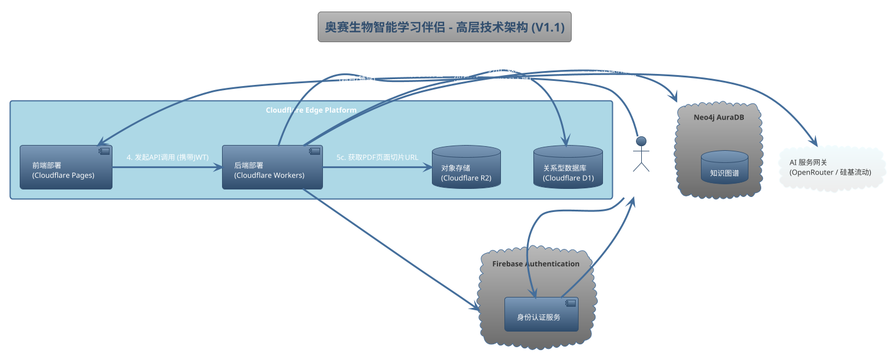

### **技术选型概述 (V1.1)**

**文档目的**：本文档旨在为“奥赛生物智能学习伴侣”项目定义初期的技术栈和架构理念。这是一个指导性的、高层次的概述，将随着项目的深入和技术验证的进行而不断迭代和完善。

#### **1. 核心设计哲学：Edge-First, Managed Services & Secure Auth**

我们的技术选型遵循三大核心原则：

1.  **边缘优先 (Edge-First)**: 尽可能将计算和数据存储推向网络边缘，靠近我们的全球用户。这能最大程度地减少网络延迟，提供极致的访问速度和响应体验。
2.  **拥抱托管服务 (Managed Services)**: 优先选择成熟的、按需付费的托管服务，而非自行搭建和维护基础设施。这能让我们的开发团队专注于核心业务逻辑的实现。
3.  **专业化认证 (Specialized Authentication)**: 使用行业领先的身份认证即服务（IDaaS），确保用户系统的安全性、可扩展性和易用性。

#### **2. 高层架构图**

#### **3. 技术组件详解**

| **组件类别** | **选定技术** | **选型理由与考量** |
| :--- | :--- | :--- |
| **用户认证** | **Google Firebase Authentication** | **理由**: 1. **安全可靠**: 由 Google 支持，提供企业级的安全性，内置密码哈希、账户枚举保护等功能，我们无需自己处理敏感的用户凭证。 2. **功能全面**: 开箱即用地支持邮箱密码、社交登录（Google, GitHub等）和密码重置流程。 3. **无缝集成**: 前端通过 Firebase SDK 与之交互，后端 Worker 可以轻松验证 Firebase 签发的 JWT (JSON Web Token)，实现安全的 API 访问控制。 4. **免费起步**: 免费套餐支持大量月活跃用户，完全满足项目初期需求。 |
| **前端部署** | **Cloudflare Pages** | **理由**: 1. **极致性能**: 与 Cloudflare Workers 无缝集成，内容通过全球CDN网络分发。 2. **简化DevOps**: 提供与 Git 的直接集成，实现自动化的持续集成与部署（CI/CD）。 3. **成本效益**: 慷慨的免费套餐足以支撑项目初期发展。 |
| **后端部署** | **Cloudflare Workers** | **理由**: 1. **低延迟**: 代码在边缘节点运行，API 响应极快。 2. **安全验证**: 可以轻松集成 JWT 验证库，对来自 Firebase 的 Token 进行校验。 3. **无缝集成**: 与 R2, D1 等 Cloudflare 服务原生集成。 **考量**: 作为备选方案，**Google Cloud Run** 可以在未来需要处理更复杂任务时作为补充。 |
| **关系型数据库 (SQL)** | **Cloudflare D1** | **理由**: 1. **边缘数据库**: 从 Worker 访问几乎零延迟。 2. **关联用户**: 数据表将使用 Firebase 提供的 **用户UID (User ID)** 作为主键或外键，与认证系统建立牢固的关联。 3. **成本可控**: 按实际用量付费。 |
| **文件/对象存储** | **Cloudflare R2** | **理由**: 1. **零出口费用**: 为全球用户提供大量PDF图片切片时，不会产生高昂的流量费用。 2. **S3兼容API**: 行业标准接口，易于使用。 |
| **图数据库** | **Neo4j AuraDB (Free Tier)** | **理由**: 1. **行业领导者**: Neo4j 是图数据库领域的黄金标准，其 Cypher 查询语言非常适合进行复杂的关系查询。 2. **托管便利**: AuraDB 是 Neo4j 的官方全托管云服务，免去了自行部署和维护的麻烦。 3. **平滑启动**: 免费套餐功能齐全。 **考量**: 这是一个外部服务，Worker 访问它会产生一定的网络延迟，需要通过合理的缓存策略进行优化。 |
| **AI 服务** | **AI 服务网关 (OpenRouter)** 或 **硅基流动** | **理由**: 1. **避免厂商锁定**: 使用 **OpenRouter** 这样的服务网关，允许我们不依赖于单一的AI提供商，可以灵活地将任务路由到当前性价比最高或效果最好的模型上。 2. **成本优化**: 可以根据需求混合使用多种模型，以最低的成本实现目标。 3. **简化接口**: 提供统一的API接口来调用不同的底层模型。 **考量**: **硅基流动** 是一个优秀的具体服务商，可以作为我们通过网关调用的模型之一，也可以直接集成。 |

#### **4. 总结与下一步**

本技术栈是一个高度现代化、以 **边缘计算** (Cloudflare) 和 **专业化托管服务** (Firebase, Neo4j) 为核心的解决方案。它将认证的复杂性交给了 Firebase，将业务逻辑放在了离用户最近的边缘，具备**高性能、高安全性、低成本、高可扩展性**和**极低运维负担**的显著优势。

下一步，开发团队应基于此选型进行小规模的技术验证（PoC - Proof of Concept），特别是针对 **前端 Firebase SDK 集成**、**Cloudflare Worker 对 Firebase JWT 的验证流程**，以及 Worker 与 Neo4j 的连接性进行测试，确保整体架构的稳定性和性能符合预期。