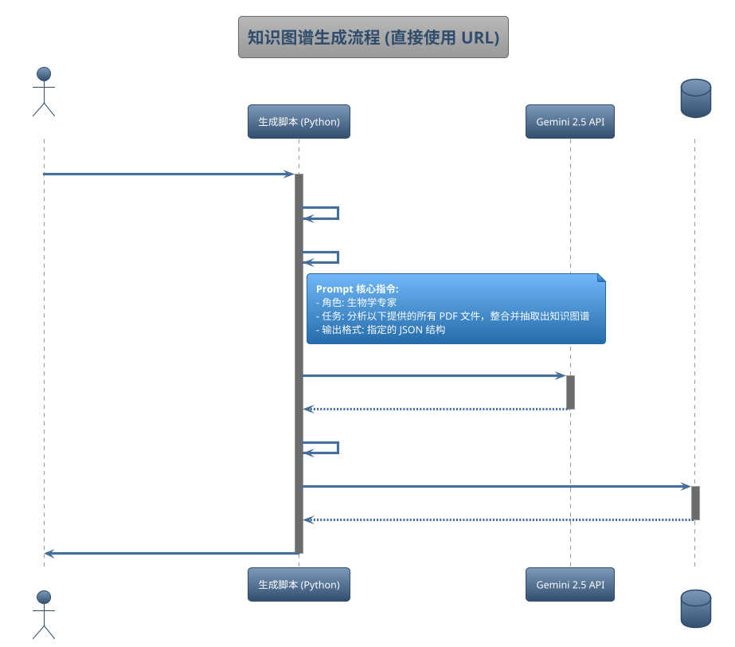

# 数据预处理序列图 (V1.2)

本文档使用 UML 序列图，可视化地展示了“内容生成引擎”的两个核心工作流。

**V1.2 更新**: 流程已极大简化，脚本不再下载和解析 PDF，直接传递公开 URL 给 Gemini 2.5 API。

---

## 序列图一：知识图谱生成 (Graph Generation)



---

## 序列图二：练习题库生成 (Question Generation)

```plantuml
@startuml
!theme spacelab
title 练习题库生成与审核流程 (V1.3 - JSON 工作流)

actor "内容管理员" as admin
participant "生成脚本 (Python)" as script
participant "Gemini API" as gemini
folder "待审核问题\n(output/generated_questions)" as generated_folder
actor "生物学专家" as expert
folder "已审核问题\n(output/processed_questions)" as processed_folder
database "Cloudflare D1" as d1

autonumber "01"

group "自动生成阶段 (generate-questions)"
    admin -> script: 运行 `generate-questions` 命令 (指定页面)
    activate script

    script -> script: 1. 构建 PDF 的公开 URL
    script -> script: 2. 构建题目生成 Prompt
    note right of script
      **Prompt 核心指令:**
      - 角色: 生物奥赛出题专家
      - 任务: 根据提供的 PDF 页面内容，生成题目
      - 输出格式: 指定的 JSON 数组结构
    end note

    script -> gemini: 3. 发起 API 请求 (携带 PDF URI 和 Prompt)
    activate gemini
    gemini --> script: 4. 返回包含题目数据的 JSON 响应
    deactivate gemini

    script -> generated_folder: 5. 将生成的题目数据存为 JSON 文件
    deactivate script
end

... 数小时或数天后 ...

group "人工审核与注入阶段 (seed-questions)"
    expert -> generated_folder: 6. 从 `generated_questions` 中取出 JSON 文件
    expert -> processed_folder: 7. 审查、修改后，将合格的 JSON 文件放入 `processed_questions`
    note left of expert: 这是离线的、手动的关键质量控制环节。\n专家只需移动和编辑文件。

    admin -> script: 8. 运行 `seed-questions` 命令
    activate script

    script -> processed_folder: 9. 读取所有**已审核**的 JSON 文件

    script -> script: 10. 将题目数据转换为 SQL INSERT 语句

    script -> d1: 11. 执行 SQL 查询，注入题目数据
    activate d1
    d1 --> script: 12. 确认数据注入成功
    deactivate d1

    script -> admin: 13. 报告注入任务完成
    deactivate script
end

@enduml
```
